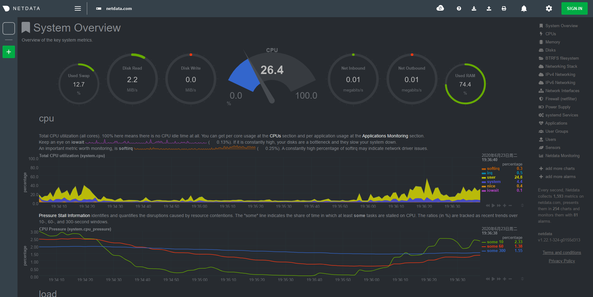
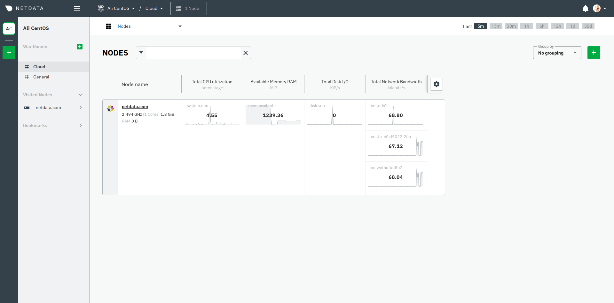

# Netdata

Web端性能监控。

## 部署

直接通过`docker-compose up -d`运行容器，访问`http://localhost:19999`即可看到对应的性能监控页面。

## 接入Netdata Cloud

点击左上角的SIGN-IN，之后按指示登录，并在宿主机中执行给出的指令以添加token，即可将性能监测数据接入到Netdata Cloud中，效果如下。

