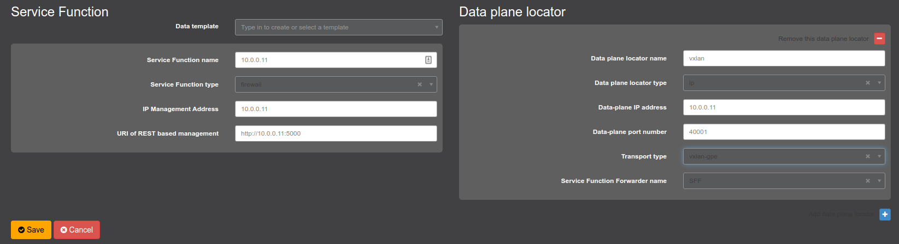
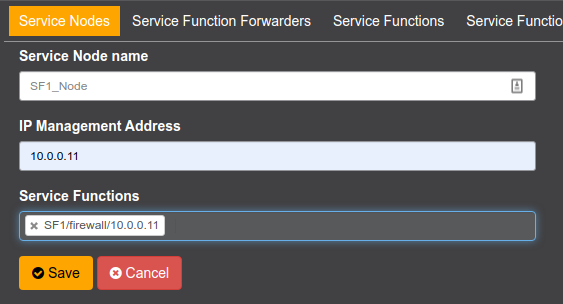
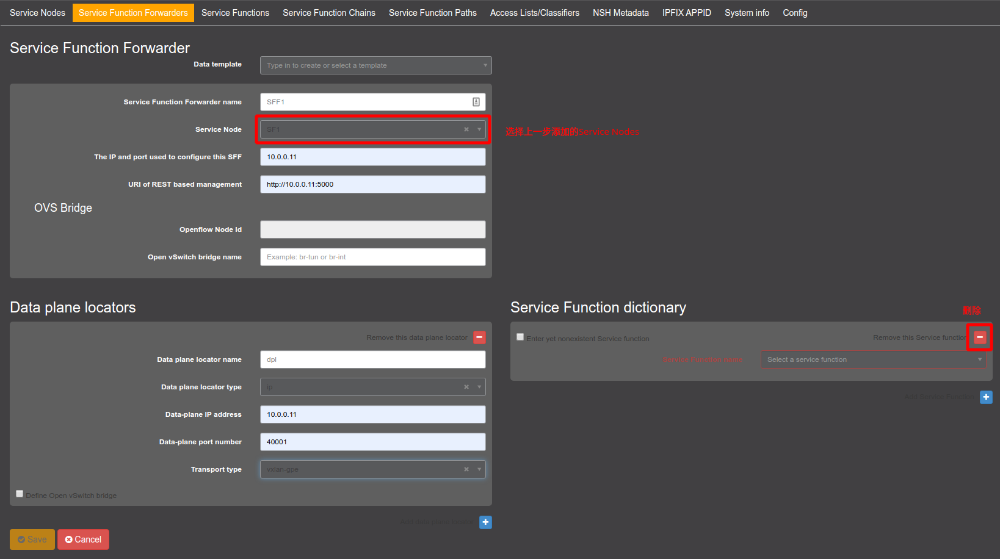
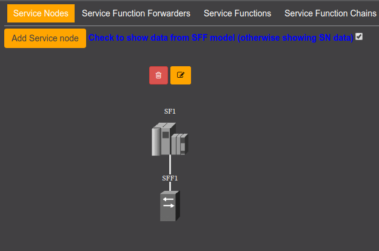

# OpenDayLight


<!-- @import "[TOC]" {cmd="toc" depthFrom=2 depthTo=6 orderedList=false} -->

<!-- code_chunk_output -->

- [OpenDayLight](#opendaylight)
  - [运行OpenDayLight](#%e8%bf%90%e8%a1%8copendaylight)
    - [运行效果](#%e8%bf%90%e8%a1%8c%e6%95%88%e6%9e%9c)
    - [向karaf会话传递指令](#%e5%90%91karaf%e4%bc%9a%e8%af%9d%e4%bc%a0%e9%80%92%e6%8c%87%e4%bb%a4)
  - [配置SFC demo](#%e9%85%8d%e7%bd%aesfc-demo)
    - [地址分配](#%e5%9c%b0%e5%9d%80%e5%88%86%e9%85%8d)
    - [ODL中添加demo](#odl%e4%b8%ad%e6%b7%bb%e5%8a%a0demo)
      - [1. 添加Service Function](#1-%e6%b7%bb%e5%8a%a0service-function)
      - [2. 添加Service Nodes](#2-%e6%b7%bb%e5%8a%a0service-nodes)
      - [3. 添加SFF](#3-%e6%b7%bb%e5%8a%a0sff)

<!-- /code_chunk_output -->

用于构建运行OpenDayLight SDN控制器的Docker镜像。以`bin/karaf`为`ENTRYPOINT`，所以在镜像运行后，ODL控制器会直接启动。  

## 运行OpenDayLight

启用OpenDayLight需要具有以下的文件结构：

```
./
├── docker-compose.yml
├── Dockerfile
├── README.md
└── source
    ├── download.sh
    ├── jdk-8u241-linux-x64.tar.gz *
    └── karaf-0.8.4.tar.gz *
```

以上带“*”的文件需要自行下载后放在对应位置，所有文件均就绪之后运行`docker-compose up --build`即可自动部署。  

> :pill: 使用`download.sh`会自动下载，但是可能下载会很慢，如有需要建议使用其他下载器手动下载。  

### 运行效果

在容器构建完开始运行后，在浏览器中输入地址`http://<hostname>:8181/index.html`并以`admin`为用户名和密码登录后，即可进入下列管理界面。  


OpenDayLight的所有配置文件均建立在容器内，随着容器删除将丢失。  

### 向karaf会话传递指令

对于已经启动的OpenDayLight，可以通过`bin/client`来向原本的交互式命名行传递指令。[^from-shell-command]
这也是`Dockerfile`中用来安装`feature`的方法：通过`Dockerfile`已经安装了部分的关于`sfc`和`l2switch`的功能，需要时自定义这一部分即可。  

`client`命令的使用如下所示，其中参数`-r 20`表示了连接失败的重试次数。  

```shell
client -r 20 "feature:instal [feature1] [feature2] ..."
```

## 配置SFC demo

默认实现了启动OpenDayLight的同时，还启动了一系列用于构建SFC demo的容器。

> :pill: 如果不需要这一部分直接在`docker-compose.yml`注释掉相关镜像即可。  

这一部分的文件结构如下：

```
.
`-- sfc\ demo
    |-- sf
    |   |-- Dockerfile
    |   `-- source 
    |       |-- download.sh
    |       `-- ... *
    `-- sff
        `-- Dockerfile
```

其中缺少的可执行文件通过`download.sh`下载。  

### 地址分配

在`docker-compose.yml`中为这一组镜像创建了指定的网络，并进行了IP地址的固定分配，各个部分的IP地址如下：  

| App          | IPv4 Address |
| ------------ | ------------ |
| OpenDayLight | 10.0.0.10    |
| SF1          | 10.0.0.11    |

### ODL中添加demo

#### 1. 添加Service Function

在`SFC => Service Functions`下选择`Add Service Function`，按如下形式填写信息：

  

#### 2. 添加Service Nodes

在`SFC => Service Nodes`下添加节点：



此时`Service Nodes`一栏可能没有变化。

#### 3. 添加SFF



另外`SFF dictionary`一栏需要删除掉。

完成后，在`Service Nodes`中将会看到对应的拓扑结构：



<!--footnotes-->

[^from-shell-command]: [scripting - Script Karaf shell commands? - Stack Overflow](https://stackoverflow.com/questions/26434360/script-karaf-shell-commands)