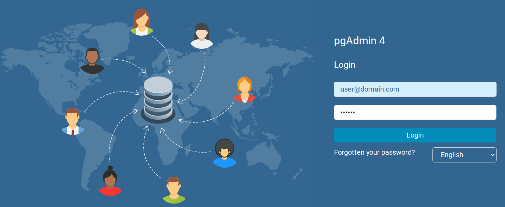
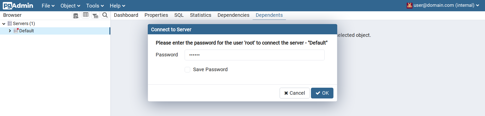

# PostgreSQL Docker部署

<!-- @import "[TOC]" {cmd="toc" depthFrom=2 depthTo=6 orderedList=false} -->

<!-- code_chunk_output -->

- [PostgreSQL Docker部署](#postgresql-docker部署)
  - [主要功能](#主要功能)
    - [端口信息](#端口信息)
  - [部署](#部署)
    - [Step 1. 安全性设置](#step-1-安全性设置)
    - [Step 2. 修改数据库存储位置](#step-2-修改数据库存储位置)
    - [Step 3. 连接使用](#step-3-连接使用)

<!-- /code_chunk_output -->

用于做PostgreSQL数据库的基本部署，网络管理使用`pgAdmin`。  

## 主要功能

- 更改了数据库的数据挂载位置。  
- 添加了`pgAdmin`，使用`servers.json`来在首次部署的时候加载服务器信息。  

### 端口信息

| App | Port |
|---|---|
| PostgreSQL | 5432（默认端口） |
| pgAdmin | 8080 |

## 部署

### Step 1. 安全性设置

- 在`docker-compose.yml`中：
  - 修改`POSTGRES_USER`以自定义数据库管理员的用户名，默认为`postgres`。修改后需要同时修改`servers.json`。（可选）  
  - 修改`POSTGRES_PASSWORD`，为数据库管理员创建密码。  
  - 修改`PGADMIN_DEFAULT_EMAIL`以自定义pgAdmin网页管理的登录用户名，默认为`user@domain.com`。（可选）
  - 修改`PGADMIN_DEFAULT_PASSWORD`，创建pgAdmin网页管理的登陆密码。  

### Step 2. 修改数据库存储位置

数据库的数据部分默认储存在`/data/PostgreSQL/db`目录下，`pgAdmin`的相关文件默认在`/data/PostgreSQL/pgamin`。
以上目录可在`docker-compose.yml`中设置。在使用前需要确保docker用户对以上的存储目录有**读写权限**。  

### Step 3. 连接使用

访问[http://localhost:8080](http://localhost:8080)即可进入pgAdmin页面，使用之前定义的（默认）用户名和密码登录即可。

下一步使用之前定义的数据库管理员密码登录。

