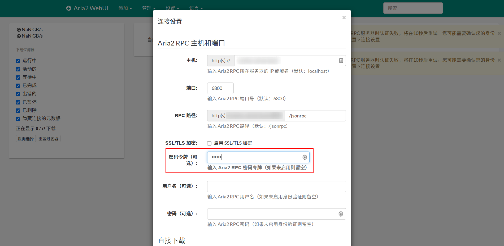

# WebUI Aria2 Docker部署

<!-- @import "[TOC]" {cmd="toc" depthFrom=2 depthTo=6 orderedList=false} -->

<!-- code_chunk_output -->

- [WebUI Aria2 Docker部署](#webui-aria2-docker部署)
  - [功能点/修改](#功能点修改)
  - [部署](#部署)
    - [Step 1. 安全性设置](#step-1-安全性设置)
    - [Step 2. 设置下载目录](#step-2-设置下载目录)
    - [Step 3. 运行容器](#step-3-运行容器)
    - [Step 4. 使用密码连接](#step-4-使用密码连接)

<!-- /code_chunk_output -->

这一份代码基于原本的[Aria2-WebUI](https://github.com/ziahamza/webui-aria2)项目创建而来，在原本的基础上按需做了一些修改。

## 功能点/修改

- 将`aria2.conf`直接导入到容器内部，可直接按需替换为自己的配置。
- 内置了`aria2.session`以保存下载会话。
- `WebUI-Aria2`的相关前端页面文件通过`git`下载。
- 对镜像内部原本的文件路径、用户做了一定的改动。

## 部署

### Step 1. 安全性设置

修改以下文件以保证安全性：  

- **`aria2.conf`中的`rpc-secret`**： 修改成想要的密码。
  这一项对应WebUI设置中使用的`token`，以对接入者身份进行验证。  

### Step 2. 设置下载目录

对下载文件的保存目录进行修改，位于`docker-compose.yml`中：  

```yml
services:
  webui-aria2:
    ...
    volumes:
      # set the download directory
      - /data/Downloads:/data
```

将`/data/Downloads`修改成所需的目录。

### Step 3. 运行容器

```shell
docker-compose up -d --build
```

### Step 4. 使用密码连接

在浏览器中访问[http://localhost:9100](http://localhost:9100)即可连接到WebUI，在`设置->连接设置`中填入第一步设置的密码便可连接到aria2。

